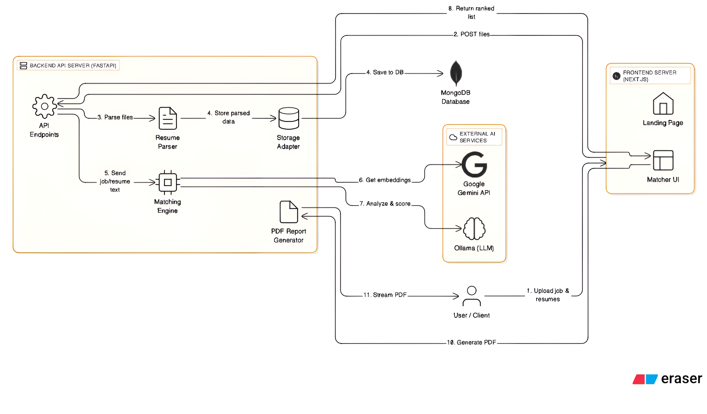

# Smart Resume Scanner



**WATCH THE DEMO VIDEO BELOW**


---

## Overview

The **Smart Resume Scanner** is an **AI-powered recruitment assistant** that helps HR teams and hiring managers quickly identify the best candidates for a job.  
It intelligently parses, analyzes, and matches resumes to job descriptions — saving time, reducing bias, and improving hiring quality.

This system leverages **Natural Language Processing (NLP)** and **Large Language Models (LLMs)** to perform contextual analysis and scoring of resumes against job descriptions.

---

## Key Features

- **AI-Powered Resume Parsing:** Automatically extracts key details like name, contact info, skills, experience, and education.
- **Intelligent Matching:** Combines embedding similarity with LLM reasoning for accurate candidate-job fit analysis.
- **NER-Based Entity Extraction:** Uses spaCy’s Named Entity Recognition (NER) to detect entities like organizations, degrees, skills, and roles.
- **Cosine Similarity Scoring:** Quantitatively measures semantic similarity between job and resume embeddings.
- **PDF Report Generation:** Creates detailed, visually structured PDF reports for top-ranked candidates.
- **Bulk Upload Support:** Allows HR teams to upload multiple resumes simultaneously.
- **Modern & Intuitive UI:** Built with Next.js for an interactive and responsive user experience.

---

## System Architecture

The architecture follows a modular and scalable design, separating the **frontend**, **backend**, and **AI service layers**.

### Architecture Flow

1. **User Uploads** job description and resumes via the frontend (Next.js).  
2. **FastAPI Backend** receives and parses uploaded files using NLP-based resume parsers.  
3. **Parsed Data** is stored in **MongoDB** using a flexible schema-less structure.  
4. **Matching Engine** sends resume and job embeddings to **Google Gemini API** and **Ollama (LLM)** for scoring and explanation generation.  
5. **Cosine Similarity** is computed on embeddings to determine baseline semantic relevance.  
6. **LLM Analysis** adds reasoning, strengths, gaps, and a justification score.  
7. **Results** are stored in MongoDB and ranked by overall match score.  
8. **PDF Report Generator** creates detailed reports using ReportLab, streamed to the frontend for download.

---

## Frontend (Next.js)

The frontend is built with **Next.js** and **React**, providing a smooth and user-friendly interface.

Users can:
- Upload job descriptions and resumes.
- View a ranked list of candidates.
- Download PDF analysis reports.

**Technologies Used:**  
Next.js · React · TypeScript · Tailwind CSS · Lucide React

---

## Backend (FastAPI)

The backend, written in **Python** with **FastAPI**, handles all core functionalities such as:

- File uploads (PDF, DOCX)
- Resume parsing with NLP + regex + NER
- Embedding generation and cosine similarity computation
- LLM-based contextual scoring (Gemini + Ollama)
- PDF report creation and streaming
- Data persistence in MongoDB

**Technologies Used:**  
Python · FastAPI · Uvicorn · MongoDB · LangChain · Ollama · Google Gemini API · spaCy · Sentence-Transformers · ReportLab · pdfminer.six · python-docx

---

## AI Matching Engine

The **Matching Engine** integrates semantic similarity with LLM reasoning for a two-layered matching approach:

### Step 1: Embedding-Based Similarity

Each resume and job description is converted into high-dimensional embeddings using the **Sentence-Transformers** library (e.g., `all-MiniLM-L6-v2`).  
Then, **Cosine Similarity** is used to calculate semantic closeness:

\[
\text{Similarity Score} = \frac{A \cdot B}{||A|| \times ||B||}
\]

This produces a quantitative similarity score between 0 and 1, forming the baseline ranking.

### Step 2: LLM Reasoning

Once similarity scores are computed, each resume-job pair is analyzed by the **LLM (Ollama or Gemini)** to provide deeper context-aware insights:

- Strengths and alignment areas  
- Skill and experience gaps  
- Final match score (0–100) with justification  

The system merges both similarity and LLM reasoning into a **weighted hybrid score** for better accuracy.

---

## LLM Prompt Design

```text
ROLE:
Act as an expert AI Recruiter. Your job is to conduct a detailed, unbiased analysis of a candidate's resume compared to a given job description.

CONTEXT:
You will be provided with structured candidate data and a job description. Your analysis should clearly identify how well the candidate’s skills, experience, and education align with the job requirements. The final output must be in valid JSON format only.

TASK:
1. Compare:
   Carefully compare the candidate’s details against the job description, focusing on:
   - Required and preferred skills
   - Relevant work experience and responsibilities
   - Educational qualifications and certifications

2. Score:
   Assign a "match_score" between 0 and 100, where 100 represents a perfect alignment with all major requirements.

3. Analyze:
   - Identify strengths where the candidate’s profile directly matches the job description.
   - Identify gaps where the candidate lacks required skills, experience, or education.

4. Summarize:
   Write a 2–3 sentence justification explaining the reasoning behind the assigned match score and the overall fit.

INPUTS:
CANDIDATE:
Name: {resume.candidate_name}
Skills: {', '.join(resume.skills)}
Experience: {' | '.join(resume.experience[:3])}
Education: {' | '.join(resume.education)}

JOB DESCRIPTION:
{job_description_text}

OUTPUT FORMAT:
Respond with a single valid JSON object only.
Do not include markdown, comments, or extra text outside the JSON.

JSON SCHEMA:
{
  "match_score": <integer between 0 and 100>,
  "strengths": ["strength1", "strength2", "strength3"],
  "gaps": ["gap1", "gap2"],
  "justification": "<2-3 sentences explaining the overall match and reasoning behind the score>"
}
```


This structured prompt ensures consistent, clean, and machine-readable output that can be easily displayed on the frontend.

---

## Natural Language Processing (NLP) Components
- **NER (Named Entity Recognition):** Extracts entities such as skills, organizations, degrees, roles, and dates using spaCy models.
- **Keyword Extraction:** Identifies primary skills and technologies using TF-IDF and contextual parsing.
- **Section Detection:** Recognizes key sections like Experience, Education, and Projects for structured parsing.
- **Embedding Generation:** Uses Sentence-Transformers to produce semantic embeddings for resume and job texts.

## Database

- MongoDB is used to store parsed resume data and job descriptions.  
- The schema-less structure allows flexibility to handle various resume formats.  

---

## Tech Stack Summary

| Layer | Technology |
|-------|-------------|
| Frontend | Next.js, React, Tailwind CSS |
| Backend | FastAPI, Python, Uvicorn |
| Database | MongoDB |
| AI/ML | Google Gemini API, Ollama LLM, LangChain, spaCy |
| Utilities | ReportLab, pdfminer.six, python-docx |

---

## API Endpoints

| Endpoint | Method | Description |
|-----------|---------|-------------|
| `/api/v1/parse` | POST | Parses a single resume |
| `/api/v1/match` | POST | Matches a single resume with a job description |
| `/api/v1/match-multiple` | POST | Matches multiple resumes with a job description |
| `/api/v1/generate-report` | POST | Generates a PDF report of the analysis |
| `/api/v1/resumes` | GET | Retrieves all parsed resumes |

---

## Getting Started

### Prerequisites

- Python 3.8+  
- Node.js 14+  
- MongoDB  

---

### Backend Setup

```bash
git clone https://github.com/anirudh7371/smart-resume-scanner.git
cd smart-resume-scanner/backend
python -m venv venv
source venv/bin/activate  # On Windows: venv\Scripts\activate
pip install -r requirements.txt
```
## Environment Setup

Create a `.env` file in the `backend` directory with the following configuration:

```env
GEMINI_API_KEY="YOUR_GEMINI_API_KEY"
DATABASE_URL="mongodb://localhost:27017/"
```

## Running the Application
### Backend Setup
Run the backend server using Uvicorn:
```bash
uvicorn src.main:app --reload
```
This starts the FastAPI backend on the default port (http://127.0.0.1:8000).

### Frontend Setup
Navigate to the frontend directory and install dependencies:
```bash
cd ../frontend
npm install
npm run dev
```
Once the server starts, visit the application in your browser:
http://localhost:3000

## Future Enhancements

- **Interviewer Assist:** Automatically generate interview questions based on candidate-job match.
- **Advanced Analytics:** Provide insights into skill gaps and candidate comparisons.
- **Multi-Language Parsing:** Add support for analyzing resumes in multiple languages.
- **ATS Integration:** Integrate with Applicant Tracking Systems for seamless workflow.